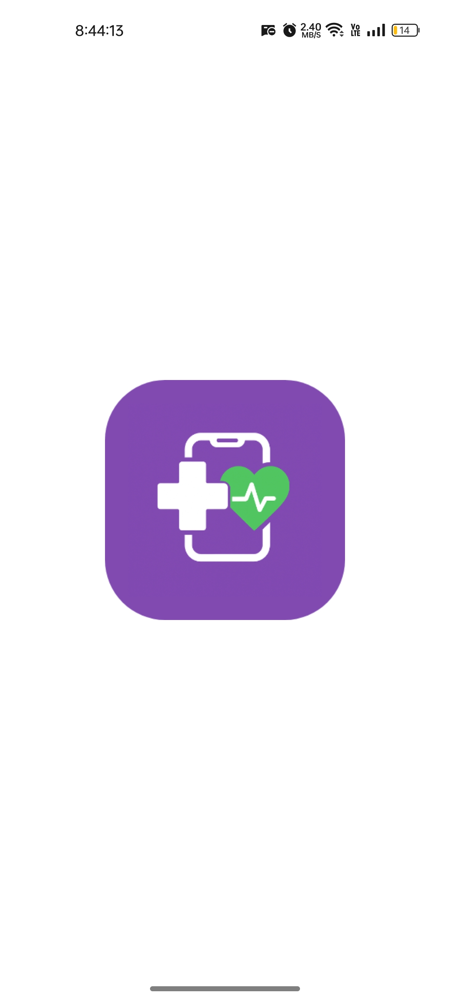
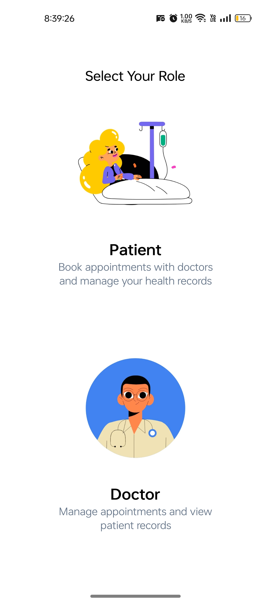
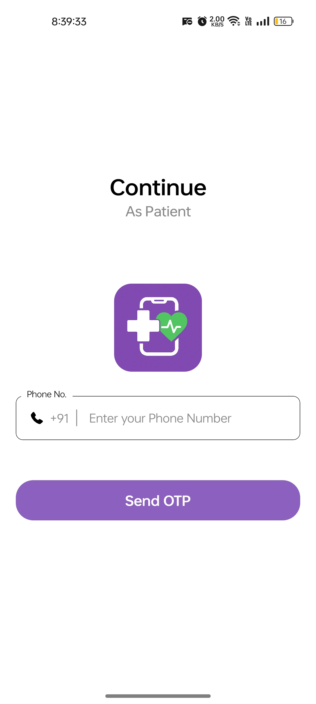
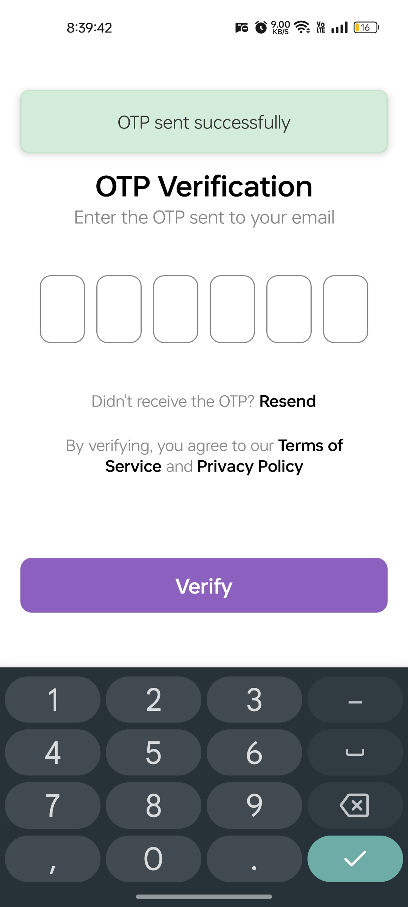
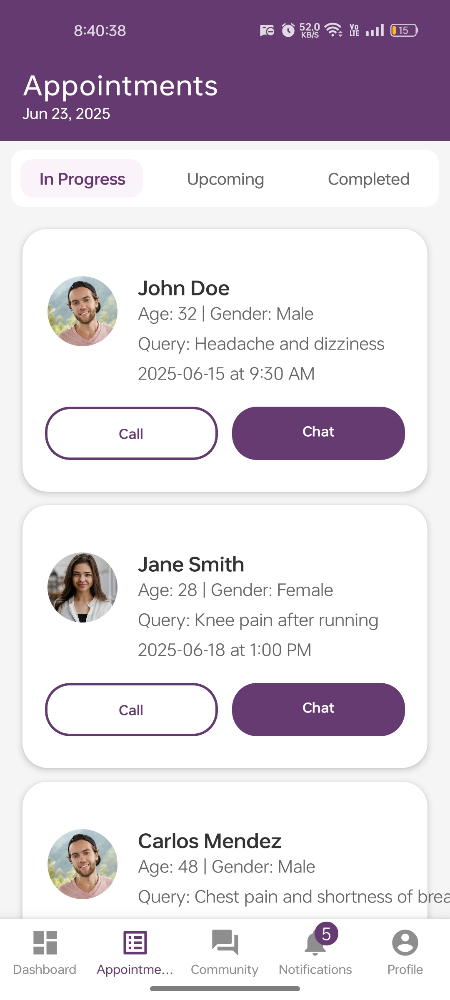
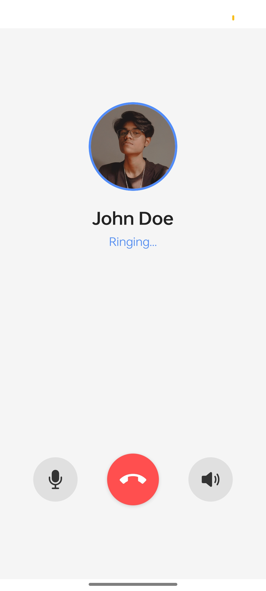
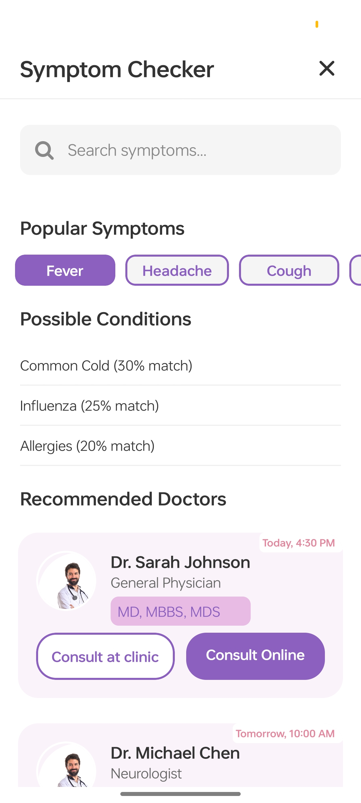

# 🏥 Healthcare App

A React Native-based mobile app that empowers users to take control of their health and wellness through smart tools like medication reminders, virtual consultations, fitness tracking, and medical education resources. This app is made for patients and doctors both.

<div style="display: flex; flex-direction: 'row';">



</div>

---

## 📱 Features

### 🔔 Medication Management

- Medication reminders with customizable alerts
- Prescription tracker with history log
- Dosage scheduling and adherence monitoring

### 🧑‍⚕️ Patient Engagement

- Schedule, cancel, and track appointments
- Share health data with doctors securely
- Post-appointment feedback for continuous improvement

### 📚 Medical Education

- Symptom checker
- Blog articles on health tips and updates
- Comprehensive disease and treatment guides
- Community forum for doctors and patients

### 💬 Virtual Consultation

- Secure chat with doctors
- HD video calling for virtual appointments
- Generate and store e-prescriptions

### 🏃‍♀️ Fitness & Wellness Tracking

- Daily activity tracking (steps, calories, distance)
- Personalized workout plans
- Nutrition and diet guide
- Sleep pattern monitoring

---

## 🛠️ Tech Stack

- **Frontend:** React Native
- **State Management:** Context API
- **Navigation:** React Navigation

---

## 🚀 Installation

```bash
git clone https://github.com/Satyndr/healthcare-app.git
npm install
npm run start
```

## 📸 Screenshots

<div style="display: flex; flex-direction: 'row';">












</div>
